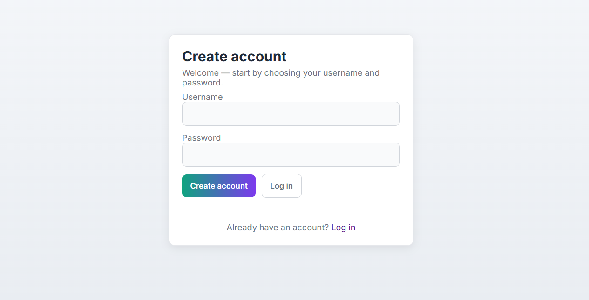
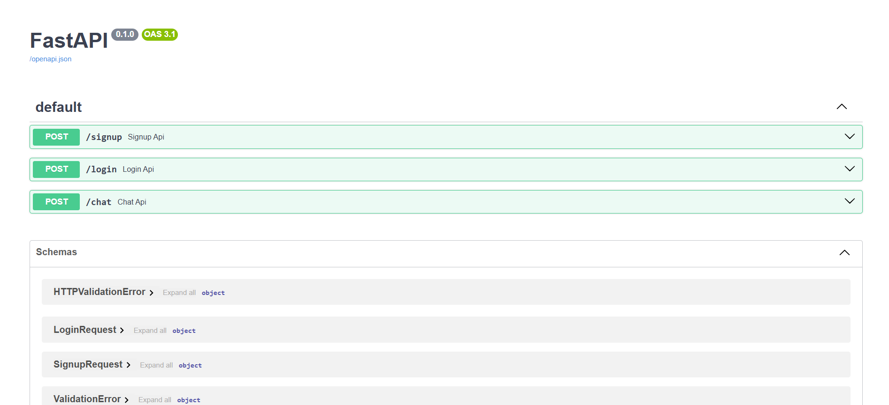
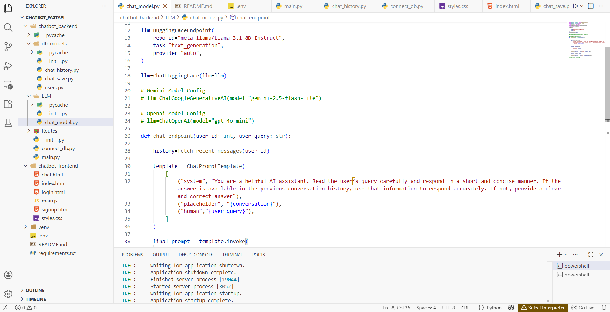
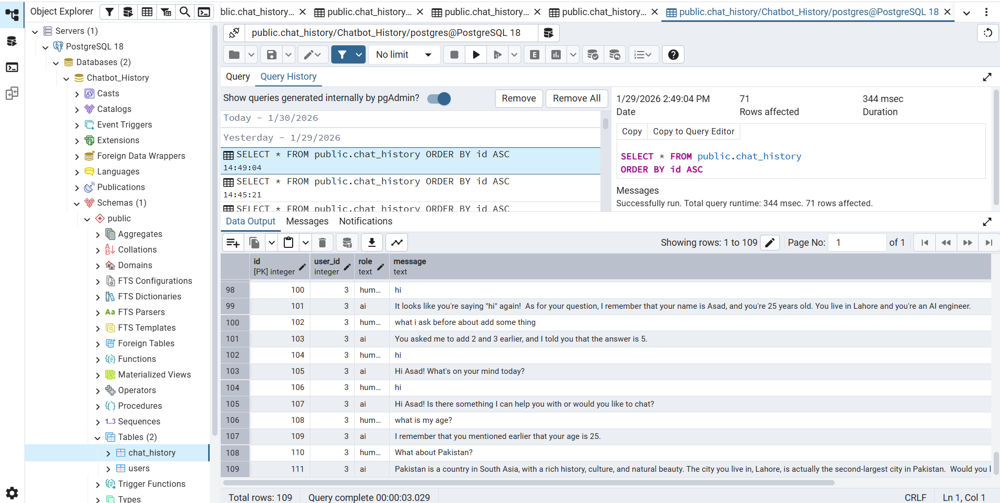

# AI Chatbot Application

A full-stack chatbot application with user authentication, conversation history, and multiple AI model integrations. Built with FastAPI backend and vanilla HTML/CSS/JavaScript frontend.

## 🚀 Features

- **User Authentication**: Signup and login functionality with secure password management
- **AI Conversations**: Chat with multiple AI models (LLaMA 3.1, Gemini, GPT-4o, etc.)
- **Conversation History**: Persistent chat history stored in PostgreSQL database
- **Context Awareness**: AI responses use previous conversation history for context
- **Multi-Model Support**: Easy switching between different LLM providers
- **CORS Enabled**: Secure cross-origin requests handling
- **Real-time Chat**: Send and receive messages with AI assistant

## Images








## 📋 Tech Stack

### Backend
- **Framework**: FastAPI (Python web framework)
- **Database**: PostgreSQL
- **Database Driver**: psycopg (PostgreSQL adapter)
- **LLM Integration**: LangChain with multiple providers:
  - HuggingFace (LLaMA 3.1-8B-Instruct)
  - Google Generative AI (Gemini)
  - OpenAI (GPT models)
  - Groq
- **Environment Management**: Python-dotenv

### Frontend
- **HTML5**: Semantic markup
- **CSS3**: Responsive styling
- **JavaScript**: Vanilla JS (no frameworks)

## 📁 Project Structure

```
Chatbot_Fastapi/
├── chatbot_backend/
│   ├── __init__.py
│   ├── main.py                 # FastAPI app initialization
│   ├── connect_db.py           # PostgreSQL connection
│   │
│   ├── db_models/              # Database operations
│   │   ├── __init__.py
│   │   ├── users.py            # User signup/login functions
│   │   ├── chat_history.py     # Fetch chat history
│   │   └── chat_save.py        # Save chat messages
│   │
│   ├── LLM/                    # AI Model configuration
│   │   ├── __init__.py
│   │   └── chat_model.py       # LLM initialization and chat endpoint
│   │
│   └── Routes/                 # API endpoints
│       ├── __init__.py
│       ├── user_routers.py     # Signup/Login endpoints
│       └── llm_routers.py      # Chat endpoint
│
└── chatbot_frontend/           # Static frontend files
    ├── index.html              # Landing page
    ├── login.html              # Login page
    ├── signup.html             # Signup page
    ├── chat.html               # Chat interface
    ├── main.js                 # Frontend logic
    ├── styles.css              # Styling
----requirement.txt
----.env
----venv


## 🔧 Installation & Setup

### Prerequisites
- Python 3.8+
- PostgreSQL database
- Node.js/npm (optional, for frontend tooling)

### Backend Setup

1. **Clone the repository and navigate to the project directory**
   ```bash
   cd Chatbot_Fastapi
   ```

2. **Create a virtual environment**
   ```bash
   python -m venv venv
   venv\Scripts\activate  # Windows
   source venv/bin/activate  # Linux/Mac
   ```

3. **Install dependencies**
   ```bash
   pip install -r requirements.txt
   ```

4. **Setup PostgreSQL Database**
   - Create a database named `Chatbot_History`
   - Update connection details in `chatbot_backend/connect_db.py`:
     ```python
     host="localhost"
     dbname="Chatbot_History"
     user="postgres"
     password="your_password"  # Change this
     port=5432
     ```
   
   - Create required tables:
     ```sql
     CREATE TABLE users (
         id SERIAL PRIMARY KEY,
         username VARCHAR(255) UNIQUE NOT NULL,
         password VARCHAR(255) NOT NULL
     );
     
     CREATE TABLE chat_history (
         id SERIAL PRIMARY KEY,
         user_id INTEGER NOT NULL REFERENCES users(id),
         role VARCHAR(50) NOT NULL,  -- 'human' or 'ai'
         message TEXT NOT NULL,
         created_at TIMESTAMP DEFAULT CURRENT_TIMESTAMP
     );
     ```

5. **Environment Configuration**
   - Create a `.env` file in the `chatbot_backend` directory
   - Add your LLM API keys:
     ```
     HUGGINGFACEHUB_API_TOKEN=your_huggingface_token
     GOOGLE_API_KEY=your_google_api_key
     OPENAI_API_KEY=your_openai_api_key
     GROQ_API_KEY=your_groq_api_key
     ```

6. **Run the backend server**
   ```bash
   cd chatbot_backend
   uvicorn main:app --reload
   ```
   Server will be available at `http://localhost:8000`

### Frontend Setup

1. **Open frontend in browser**
   - Simply open `chatbot_frontend/index.html` in your web browser
   - Or serve it using a simple HTTP server:
     ```bash
     cd chatbot_frontend
     python -m http.server 8001  # Python
     ```

## 📡 API Endpoints

### User Management

**Sign Up**
- **POST** `/signup`
- Request body:
  ```json
  {
    "username": "john_doe",
    "password": "password123"
  }
  ```
- Response:
  ```json
  {
    "success": true,
    "message": "User created successfully"
  }
  ```

**Login**
- **POST** `/login`
- Request body:
  ```json
  {
    "username": "john_doe",
    "password": "password123"
  }
  ```
- Response:
  ```json
  {
    "success": true,
    "message": "Login successful",
    "user_id": 1
  }
  ```

### Chat

**Send Message**
- **POST** `/chat`
- Request body:
  ```json
  {
    "user_id": 1,
    "query": "What is machine learning?"
  }
  ```
- Response:
  ```json
  {
    "Response": "Machine learning is a subset of artificial intelligence..."
  }
  ```

## 🤖 AI Model Configuration

The application is configured to use **HuggingFace LLaMA 3.1-8B-Instruct** by default. You can switch models by editing `chatbot_backend/LLM/chat_model.py`:

### Active Configuration
```python
llm = HuggingFaceEndpoint(
    repo_id="meta-llama/Llama-3.1-8B-Instruct",
    task="text_generation",
    provider="auto",
)
```

### Available Models (Commented Out)
```python
# Google Gemini
# llm = ChatGoogleGenerativeAI(model="gemini-2.5-flash-lite")

# OpenAI GPT-4
# llm = ChatOpenAI(model="gpt-4o-mini")

# Groq LLaMA
# llm = ChatGroq(model="llama3-70b-8192")
```

## 💾 Database Schema

### Users Table
- `id`: Primary key (auto-increment)
- `username`: Unique username
- `password`: User password

### Chat History Table
- `id`: Primary key (auto-increment)
- `user_id`: Foreign key to users table
- `role`: 'human' or 'ai' (message sender)
- `message`: Chat message content
- `created_at`: Timestamp of message creation

## 🔄 How It Works

1. **User Authentication**
   - User signs up/logs in via frontend
   - Backend stores user credentials in PostgreSQL
   - User receives `user_id` after successful login

2. **Chat Flow**
   - User sends a query through chat interface
   - Frontend sends request to `/chat` endpoint with `user_id` and `query`
   - Backend fetches recent conversation history from database
   - LLM generates response using context from history
   - Both user query and AI response are saved to database
   - Response is sent back to frontend and displayed

3. **Context Management**
   - Last 100 messages from user's conversation are fetched (configurable)
   - Messages are formatted and passed to LLM as context
   - This enables coherent multi-turn conversations

## 🛠️ Development

### Adding New LLM Provider
1. Install the corresponding LangChain package
2. Import the chat model in `chat_model.py`
3. Replace the `llm` variable with new model configuration
4. Update `requirements.txt` with new dependency

### Modifying Database Schema
1. Create migration in PostgreSQL
2. Update corresponding model functions in `db_models/`
3. Update API endpoints if needed

## 📦 Dependencies

See `requirements.txt` for the complete list:
- **fastapi**: Web framework
- **uvicorn**: ASGI server
- **psycopg**: PostgreSQL adapter
- **pydantic**: Data validation
- **langchain**: LLM framework
- **python-dotenv**: Environment variable management

## 🔐 Security Notes

⚠️ **Important**: This is a development version. For production:
- Use HTTPS instead of HTTP
- Implement proper password hashing (bcrypt, argon2)
- Add JWT token authentication instead of plain user_id
- Use environment variables for all sensitive data
- Implement rate limiting and input validation
- Add CORS restrictions for specific domains

## 🚀 Running the Application

**Terminal 1 (Backend)**
```bash
cd chatbot_backend
uvicorn main:app --reload --host 0.0.0.0 --port 8000
```

**Terminal 2 (Frontend)**
```bash
cd chatbot_frontend
python -m http.server 8001
```

Then open your browser to:
- Frontend: `http://localhost:8001/index.html`
- API Docs: `http://localhost:8000/docs`

## 📝 License

This project is open source and available under the MIT License.

## 🤝 Contributing

Feel free to submit issues and enhancement requests!

## 📧 Support

For questions or issues, please create an issue in the repository.


